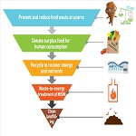
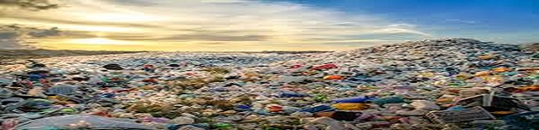
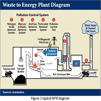

<!DOCTYPE html PUBLIC "-//W3C//DTD XHTML 1.0 Transitional//EN" "http://www.w3.org/TR/xhtml1/DTD/xhtml1-transitional.dtd">
<html xmlns="http://www.w3.org/1999/xhtml">
<head>
<title></title>
<meta http-equiv="Content-Type" content="text/html; charset=UTF-8" />
<link href="style.css" rel="stylesheet" type="text/css" />

</head>
<body>

  

    

      

        <ul>
          <li class="active"><a href="index.html">Home</a></li>
          <li></li>
          <li></li>
          <li></li>
          <li></li>
        </ul>
        

      

      

        <form id="formsearch" name="formsearch" method="post" action="#">
          <input name="button_search" src="images/search_btn.gif" class="button_search" type="image" />
          
          
          
        </form>
      

      

      

        <h1><a href="index.html"> 
          <small></small></a></h1>
      

    

  

  

              

                

                  

                    <h2>Various Waste Disposal Problems</h2>
                    
                    
Posted by <a href="#">Freshers</a> | Filed under <a href="#">templates</a>, <a href="#">internet</a>

                    
Production of too much waste
                      One of the major waste disposal problems is attributed to the generation of too much waste. America alone is responsible for the producing of about 220 million tons of waste annually. In 2007 for instance, it’s recorded that Americans generated nearly 260 million tons of municipal solid waste. This is about 2.1 kg per person each day. The point is; if these are only figures in America, let’s try to imagine the amount of waste produced by the rest of the population across the globe.
                      
                      
                      ADVERTISING
                      
                      
                      According to the World Bank report, the average global municipal solid waste (MSW) generation per person on daily basis is about 1.2 kg and the figure is expected to rise up to 1.5 kg by 2025. It therefore means that every state and local authority suffer the problem of effective waste disposal due to the generation of too much waste. The problem is that the present era is driven by a throw-away consumerism with companies and producers striving to maximize profits by producing one-time use products without prioritizing on reuse, recycling or the use of environmentally friendly materials.
                      
                      Most of the waste is toxic
                      The majority of the state and local authority legislations are generally lax on regulating the ever-expanding manufacturing industries. On a daily basis, these industries produce toxic products that end up getting thrown away after use. Most of the products contain hazardous and health-threatening chemicals.
                      
                      READ  Various Human Activities That Affect an Ecosystem
                      A report by the U.S. EPA indicates that more than 60,000 untested chemicals are present in the consumer products in our homes. There are even products known to contain toxic chemicals, such as Biphenyl-A (BPA) – often present in plastic toys, but they are still poorly regulated. Packaging is also one of the biggest and rapidly enlarging categories of solid waste which accounts for 30% of MSW and approximately 40% of the waste is plastic which is never biodegradable. It’s this level of toxicity together with the lax regulatory laws that exacerbates the problem of dealing with waste disposal.
                      
                      
                      Landfills are a problem as well
                      Most landfills lack proper on-site waste management thereby contributing to additional threats to the environment. In the long-term, landfills leak and pollute ground water and other neighboring environmental habitats making waste management very difficult. They also give off potentially unsafe gases.
                      
                      Also, the laws and regulation guiding the operations of landfills are often lax at monitoring and regulating the different types of wastes namely medical waste, municipal waste, special waste or hazardous waste. With this kind of laxity of the laws in landfill waste management, the landfills toxicity and hazardous nature significantly increases to a point where the landfill waste problems often lasts for up to 30 years.
                      
                      Regulations are based on vested interests
                      Since waste disposal and management has become a profit making venture, those who advocate for safe, quality and proper management of waste disposal are outmatched by industries in the business. Large enterprises in the waste disposal business dictate all aspects of the market from operating landfills, sewer systems and incinerators to recycling facilities. The corporations simply aim at making profits regardless of the waste reduction requirements or the resultant destructive environment impacts.

        

        

          <h2>Concern To Plastic </h2>
          
Posted by <a href="#">Freshers</a> 
          
          

            It is estimated that almost all 8 billion tonnes of plastics ever produced are still in the environment, flooding the planet with plastic. With the growing population and increasing consumer expenditure, especially in China and India, the demand for plastics is expected to double by 2050, raising concerns about the impact it will have on the environment. Numerous studies show that issues associated with plastic pollution such as the presence of microplastics in bottled waters, the low decomposition rate of such materials and the introduction of it to the ocean pose high threats to human health and the different ecosystems found on our the planet. Therefore, there is an urge to come up with a set of integrated solutions to reduce and mitigate the problem. <a href="#">AIMS FOR A MORE SUSTAINABLE FUTURE 
              The 1CONCERNS AROUND PLASTIC7 Sustainable Development Goals (SDGs) established by the UN in 2015 addresses several challenges that we are facing on a global scale and, although plastic pollution is not presented as one of the main issues, it is closely related to various objectives such as Clean water and sanitation, Responsible consumption and production, and Life below water to mention some of them. Additionally, many companies have recently announced ambitious commitments on plastics which are intended to be achieved by the next 5-10 years. Most of the goals are focusing on achieving partial or full recycling rates by 2025 or 2030.

          
 &nbsp;&bull;&nbsp; 

          

            

              

                

                  <h2>Waste to Energy</h2>
                  
Posted by <a href="#">Freshers</a> | Filed under <a href="#">templates</a>, <a href="#">internet</a>

                  
                  
Where can WTE be used?
                    Areas with an established waste management and collection system
                    Consistent supply of solid waste, as treatment costs increase with shortages
                    Regions with high energy demand/price to allow for cost of recovery from waste3
                    Benefits of WTE
                    Electricity from WTE plants can range from very micro up to 30 MW installed capacity
                    Generating electricity from incineration releases less CO2, SO2, NOx and mercury than coal and oil4
                    Landfill waste is reduced, as is the resulting leachate and methane from decomposing landfills
                    Waste is a fairly reliable source of energy and production is typically predictable and low cost whereas fossil fuel prices can fluctuate dramatically
                    Downsides of WTE
                    Air pollution can increase as scrubbing technologies are very expensive
                    Releases carbon from non-biodegradables which would otherwise be stored in landfill
                    Ash and flue gas cleaning residues from incineration can also cause leachate problems if not properly disposed of
                    Generating electricity from incineration releases more CO2, SO2, NOx and mercury than natural gas or renewables5
                    Conclusion
                    Waste incineration is an expensive method of electricity generation and has environmental trade-offs.6,7 Recycling systems in the waste management chain prior to incineration adds even more cost. Nevertheless, WTE can be very useful in areas with limited space for landfill or where transport costs are high. Small islands and dense urban areas with high energy prices are especially suitable for WTE. <a href="http://creativecommons.org/licenses/by/3.0/">Creative Commons Attribution 3.0 License</a>, which means that you are free to use it for any personal or commercial purpose provided you credit me in the form of a link back to BlueWebTemplates.com.

                    

      

      

        

          <h2 class="star"> </h2>
          <ul class="sb_menu">
            <li></li>
            <li></li>
            <li></li>
            <li></li>
            <li></li>
            <li></li>
          </ul>
        

        

          <h2 class="star">Sponsors</h2>
          <ul class="ex_menu">
            <li><a href="#">Kartik Garg</a> 
              </li>
            <li><a href="#">Ayush Mishra</a> 
              </li>
            <li> 
              </li>
            <li> 
              </li>
            <li> 
              </li>
            <li> 
              </li>
          </ul>
        

      

      

    

  

  

    

      

        <h2>About</h2>
        
        
 We both are from ABESIT College of Engineering. We are initiating a project on waste management on the occasion of Hacknovate 2.0 with some new ideas. For further details contact below. <a href="#">Learn more...</a>

      

      

        <h2>Points to remember </h2>
        <ul class="sb_menu">
          <li><a href="#">Reuse</a></li>
          <li><a href="#">Reduce</a></li>
          <li><a href="#">Recycle</a></li>
          <li></li>
          <li></li>
        </ul>
      

      

        <h2>Contact</h2>
        

        
<strong>Phone:</strong> 9625651910,9354007718 
          <strong>Address:</strong>ABES Institute of Technology  
          <strong>E-mail:</strong> <a href="#">gargkartik305@gmail.com,ayush.mishraabesit24@gmail.com</a>

      

      

    

  

  

    

      
&copy; Designed by Freshers 

      <ul class="fmenu">
        <li class="active"><a href="index.html">Home</a></li>
        <li></li>
        <li></li>
        <li></li>
        <li></li>
      </ul>
      

    

  

</body>
</html>
